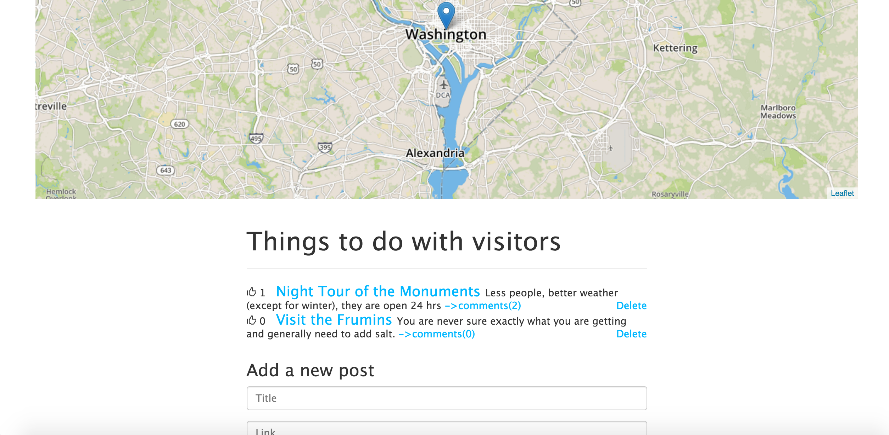
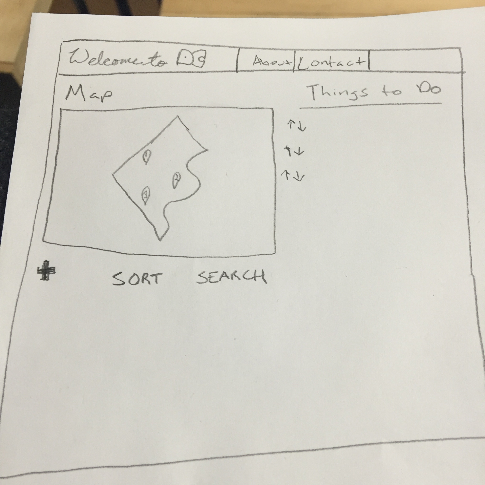
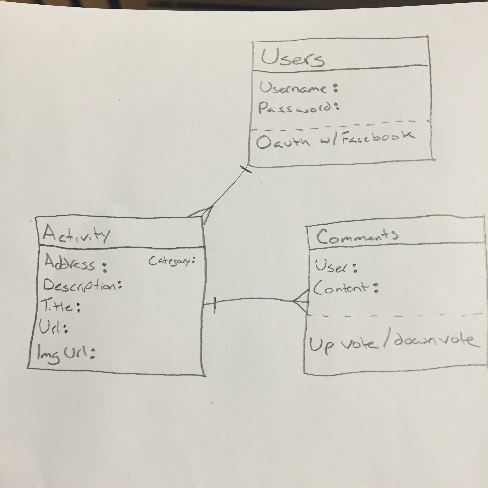

Welcome to DC
=============
Map of DC with markers with suggested things to do with visitors. See [User Stories](planning/userStories.md "Wireframe") for more info.

Tools:
-----
* Yeoman (played with it but did not end up using)
* MEAN Stack
* Heroku to Deploy
* Bootstrap
* Leaflet

Challenges:
-----------
Passport integration got it up and running but broke everything in the process. Did a git --reset hard, will try again next week. getting points to plot on submit.

Notes:
------
Based off of [MEAN Stack tutorial](https://thinkster.io/angulartutorial/mean-stack-tutorial/)

Install & Run:
--------------
		$ npm install
		$ npm start
		$ nodemon app.js

		make sure mongo is running: mongod --config /usr/local/etc/mongod.conf

Things to Do:
-------------
1. style map/hide keys
2. cap scroll
3. user auth (take 2)
4. add flash message that says posted when a post is successfully added
6. Comment and breakout code... controller folder, factory... resources views

Screenshot:
----------

Wireframe:
---------

ERD:
----

